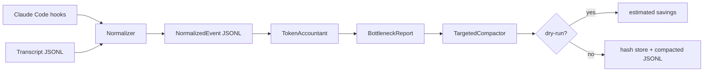

# cc-context-telemetry

`cc-context-telemetry` is a Bun and TypeScript tool for measuring where context tokens go in Claude Code sessions, then compacting the categories that are actually responsible for context growth.

It supports two ingestion modes:

- Claude Code `PreToolUse` and `PostToolUse` hook payloads normalized into JSONL.
- Offline parsing of transcript JSONL.

The output is a `BottleneckReport`: category shares, top payloads, context growth curve, and burn-rate. The `TargetedCompactor` can then dry-run or apply selective compaction for verbose tool results and Write/Edit file payloads.

## Quickstart

```bash
bun install
bun test
bun run typecheck

bun src/cli.ts analyze examples/sample-transcript.jsonl --top 5
bun src/cli.ts compact examples/sample-transcript.jsonl --dry-run
```

Apply compaction to a transcript copy:

```bash
bun src/cli.ts compact examples/sample-transcript.jsonl \
  --apply \
  --out .cc-context-telemetry/compacted.jsonl \
  --store .cc-context-telemetry/store \
  --tool-result-threshold 80 \
  --file-payload-threshold 80 \
  --keep-last 1
```

## Claude Code Hooks

Configure hooks to append normalized events:

```json
{
  "hooks": {
    "PreToolUse": [
      {
        "matcher": "*",
        "hooks": [
          {
            "type": "command",
            "command": "bun /absolute/path/to/cc-context-telemetry/src/cli.ts hook pre --append .cc-context-telemetry/session.jsonl"
          }
        ]
      }
    ],
    "PostToolUse": [
      {
        "matcher": "*",
        "hooks": [
          {
            "type": "command",
            "command": "bun /absolute/path/to/cc-context-telemetry/src/cli.ts hook post --append .cc-context-telemetry/session.jsonl"
          }
        ]
      }
    ]
  }
}
```

Then inspect the session:

```bash
bun src/cli.ts analyze .cc-context-telemetry/session.jsonl
```

## Architecture



Core modules:

- `parser.ts`: strict-ish normalization for transcript records and hook payloads.
- `accountant.ts`: category token accounting, shares, growth curve, and burn-rate.
- `report.ts`: bottleneck selection, top-N payloads, and recommended compaction target.
- `compactor.ts`: selective compaction for older verbose tool results and file payloads.
- `store.ts`: content-addressed storage for extracted file payloads.
- `cli.ts`: scriptable commands for `analyze`, `compact`, and `hook`.

## Data Story: Where Tokens Go In Agentic Coding

Agentic coding sessions do not spend context evenly. In practice, context growth often clusters in a few repeatable places:

- Tool results from shell commands, tests, package managers, and search commands can dominate after only a few verbose runs.
- Write/Edit payloads can duplicate full file content in the conversation even though the file already exists on disk.
- Tool arguments may become large when generated code, patches, or serialized data are embedded directly.
- User and assistant text are often important, but they are not always the biggest token source.

This matters because blanket summarization can compress the wrong thing. A small summary of recent reasoning may harm task continuity while leaving oversized command output untouched. `cc-context-telemetry` measures category shares first, then targets the real bottleneck. The intended workflow is:

1. Capture a baseline transcript or hook stream.
2. Run `analyze` and identify the primary category by token share.
3. Run `compact --dry-run` to estimate savings without changing the transcript.
4. Apply compaction only after the policy removes the measured bottleneck.
5. Compare task success, latency, and context size against the baseline.

## Token Categories

- `system`: system and instruction text.
- `user`: user-authored text.
- `assistant-reasoning`: assistant text segments.
- `tool-args`: tool input arguments, with large file payload fields separated.
- `tool-result`: command and tool output.
- `file-payloads`: Write/Edit/MultiEdit content captured as its own segment.
- `mcp-output`: tool result records whose tool name is MCP-like.

Token counts use a deterministic approximate estimator by default. If your transcript already includes token counts, those values are preserved.

## Compaction Policy

`TargetedCompactor` supports:

- Tool-result compaction for older results above a threshold while keeping the last `N` raw results.
- File payload extraction to a `sha256` content-addressed store with a `ccct://sha256/...` pointer plus a short summary.
- Dry-run mode that reports expected savings without mutating events or writing store files.

The compactor is deliberately selective. It does not summarize every message, and it does not remove recent raw tool results by default.

## Development

```bash
bun install
bun run check
```

The project uses `bun:test`, strict TypeScript, and a generic-content scan that rejects company-specific names, host-like strings, IP addresses, obvious secret assignments, and personal email addresses in repository text.

## License

MIT
